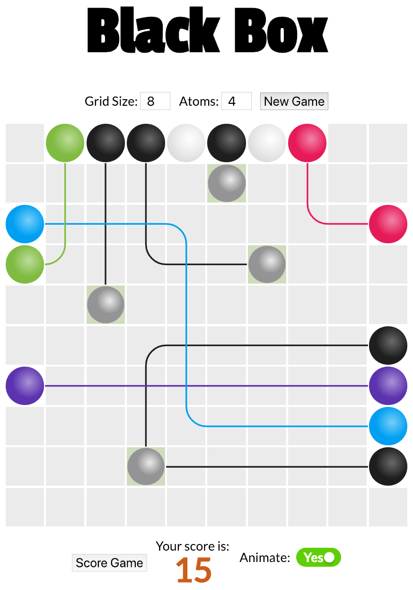

[](https://travis-ci.org/jonurry/black-box)
[](https://codecov.io/gh/jonurry/black-box)

# Black Box



Web app implementation of the puzzle game released by Waddingtons and Parker in the 1970s.

Black Box is an abstract board game for one or two players, which simulates shooting rays into a black box to deduce the locations of "atoms" hidden inside. It was created by Eric Solomon. The board game was published by Waddingtons from the mid-1970s and by Parker Brothers in the late 1970s. The game can also be played with pen and paper, and there are numerous computer implementations for many different platforms, including one which can be run from the Emacs text editor.

Black Box was inspired by the work of Godfrey Hounsfield who was awarded the 1979 Nobel Prize in Medicine for his invention of the CAT scanner.

You can play this implementation of Black Box here:

http://blackbox.urry.me

## Setup

To clone this repository:

```
git clone git@github.com:jonurry/black-box.git
```

Change to the new project directory:

```
cd black-box
```

Install dependencies:

```
npm install
```

### Run Test

To run tests with coverage:

```
npm test
```

or

```
npm run test:c
```

To run tests in watch mode:

```
npm run test:w
```

To run tests in verbose mode:

```
npm run test:v
```

## Why I Built It

I wanted an interesting project to practice the `JavaScript` skills that I had been learning. Black Box presented some fairly complex game logic that was fun to code and play with. I knew that I would be able to practice a few design patterns, `MVC` included. There's plenty of scope for expansion too. I could add high scores, saving game state, adding audio and multi-player capabilities in the future.

## How I Built It

Black Box was written from scratch and by hand. I didn't want to take any short cuts as it was a vehicle for me to `learn` how to do things from `first principles`, using `fundamentals`. I chose not to use any frameworks or libraries. The JavaScript and CSS is `vanilla`.

I wanted to practice different layout methods so I used `Grid` CSS with a fallback of `Flex`. For browsers that don't support either Grid or Flex I fallback to a basic block and float layout.

The website is `responsive`, of course. I regard this as a fundamental requirement, building a `mobile friendly` site first and then `progressively enhancing` the site depending on the device's capabilities and available screen real estate.

I'm keen to employ `test-driven development`. After reviewing the available options, I chose `Jest` by Facebook and all of the game logic is backed up by `unit tests`. I may add screenshot testing in the future.

Another area that really interests me is `design patterns`. I used a few design patterns for Black Box including `MVC`. In the future, I may implement new versions of the View layer in React and Vue and allow the user to switch between them.

I'm interested in build tools having created one myself in the past for a previous company. I thought about learning Grunt or WebPack but I was learning so many other things I thought it would be better to use `CodeKit` on this project. CodeKit wraps a lot of the useful functionality of a build tool in a nice UI. I was able to quickly add `ES6` and `SASS` pre-processing, automatically add browser specific prefixes in `CSS`, `minify` and concatenate files, create `source maps` and `optimise images`. CodeKit also has its own web server so you can view your website in real time on multiple local devices and browsers for testing purposes.

There's many development IDE's to choose from. I went with `Atom` by GitHub. It is basically a text editor built with internet technologies. I added several web development packages to supercharge my working environment.

I chose `GitHub` for source control duties. You can see all of the code on my GitHub BlackBox project page.

The Black Box website is hosted via `GitHub Pages`. This is free for open source projects.

## Tech Stack

| Technology         | Description                                                                                                                                                                                                                            |
| ------------------ | -------------------------------------------------------------------------------------------------------------------------------------------------------------------------------------------------------------------------------------- |
| `HTML`             | The structural and semantic design of the web site.                                                                                                                                                                                    |
| `Vanilla CSS`      | There were no UI frameworks or libraries used in this project. All CSS was hand written from scratch unless otherwise stated in the code base.                                                                                         |
| `Float Layout`     | Basic default layout to work in all browsers.                                                                                                                                                                                          |
| `Flex Layout`      | Flex layout that can be used by 97% of today's browsers (by usage). Progressive enhancement over float layout.                                                                                                                         |
| `Grid Layout`      | Grid CSS layout that can be used by 76% of today's browsers (by usage). Progressive enhancement over flex layout.                                                                                                                      |
| `SASS`             | Taking advantage of variables etc.                                                                                                                                                                                                     |
| `Vanilla JS`       | All JavaScript was hand written from scratch except for the SVG animation which was adapted from another source.                                                                                                                       |
| `ES6`              | Taking advantage of the latest enhancements to the JS specification where appropriate.                                                                                                                                                 |
| `Responsive`       | The UI is responsive and will change according to the size of the device's screen. A mobile first design is employed with enhancements for larger screens. The Black Box grid will always fill the smaller of the screen's dimensions. |
| `Unit Tests`       | All game logic has been unit tested using Jest by Facebook. Both public and private methods tested.                                                                                                                                    |
| `Design Patterns`  | The Model View Controller (MVC) pattern has been used to separate the application code from the UI presentation layer. The controller binds the two layers together.                                                                   |
| `Namespace`        | All application code is protected by being contained in a single namespace accessible from the global context.                                                                                                                         |
| `Module`           | Each code module is self-contained and independently testable.                                                                                                                                                                         |
| `Encapsulation`    | Modules expose public methods and hide internal logic.                                                                                                                                                                                 |
| `Prototype`        | Reusable methods are attached to the object's prototype to manage memory and resources better.                                                                                                                                         |
| `SVG Drawing`      | Light rays are traced on an SVG element at the end of the game. The path of each light ray is recorded and rendered.                                                                                                                   |
| `SVG Animation`    | Light rays are animated by default. This can be switched off in the UI. The SVG paths are traced over a period of time.                                                                                                                |
| `Google Fonts`     | Google web fonts are used where appropriate. They are served from Google's CDN.                                                                                                                                                        |
| `IDE`              | GitHub's open source Atom Text Editor with plugins for web development.                                                                                                                                                                |
| `CodeKit`          | Mac application for compiling, building and optimising web sites.                                                                                                                                                                      |
| `Chrome Inspector` | Debug web sites in Google's browser.                                                                                                                                                                                                   |
| `ESLint`           | Check code syntax.                                                                                                                                                                                                                     |
| `Babel`            | Use the latest JavaScript language improvements and have them compiled to standard JavaScript.                                                                                                                                         |
| `Prettier`         | Format your code in a standard and attractive way.                                                                                                                                                                                     |
| `Auto Prefixer`    | Don't worry about vendor specific CSS prefixes.                                                                                                                                                                                        |
| `Source Maps`      | Allow minified/uglified code to be debugged in the browser.                                                                                                                                                                            |
| `Performance`      | Combine multiple files into one to cut down on server requests. Reduce the size of code files to make them faster to download (minifying). Reduce the size of images so that they can be downloaded faster.                            |
